<h4 align="center"> 
    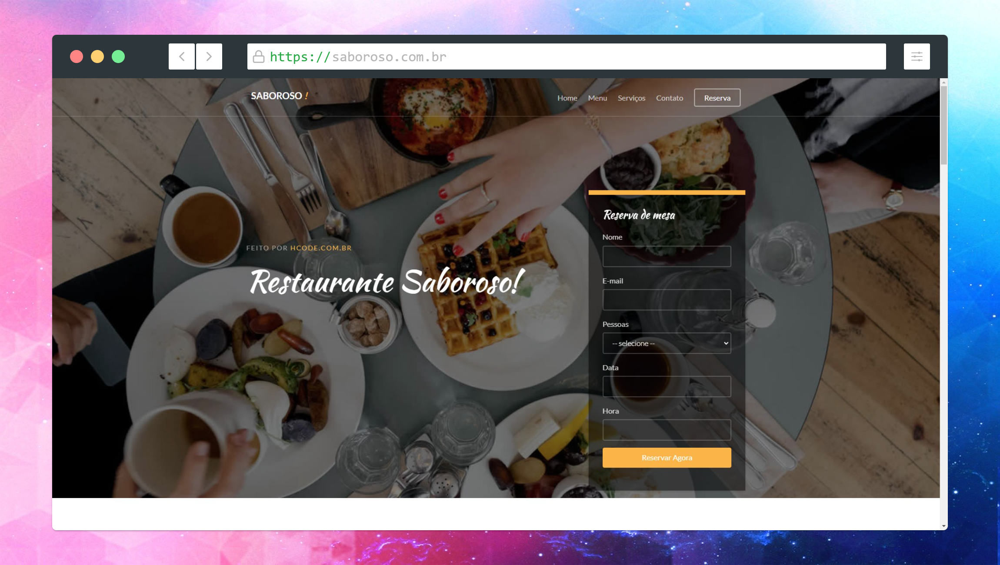<br>
	🚧 Restaurante Saboroso 🚀 Concluido...  🚧
</h4>

Projeto desenvolvido como exemplo de um restaurante com parte para usuário cliente e para gerenciamento administrativo.

## ✅ Funções

- [x] Tela Home
- [x] Tela Menus
- [x] Tela Serviços
- [x] Tela Contatos
- [x] Tela Reservas
- [x] Tela de Login
- [x] Gerenciamento Menus
- [x] Gerenciamento Serviços
- [x] Gerenciamento Contatos
- [x] Gerenciamento Reservas
- [x] Gerenciamento Usuários

## 🛠 Tecnologias

As seguintes ferramentas foram usadas na construção do projeto:

-  [JavaScript](https://developer.mozilla.org/pt-BR/docs/Web/JavaScript)
-  [HTML5](https://developer.mozilla.org/pt-BR/docs/Web/HTML)
-  [Mysql](https://www.mysql.com/)
          

## 🖥️ Plataforma adotada

  - WEB

## 📸 Screenshot


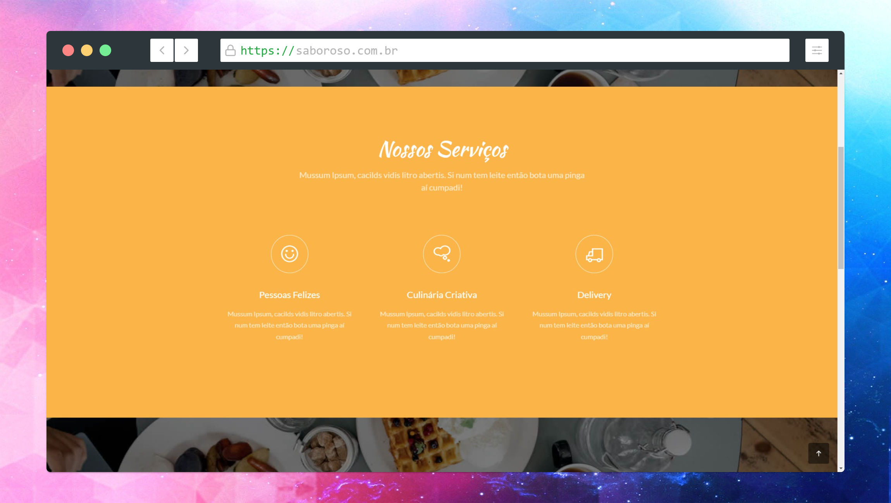

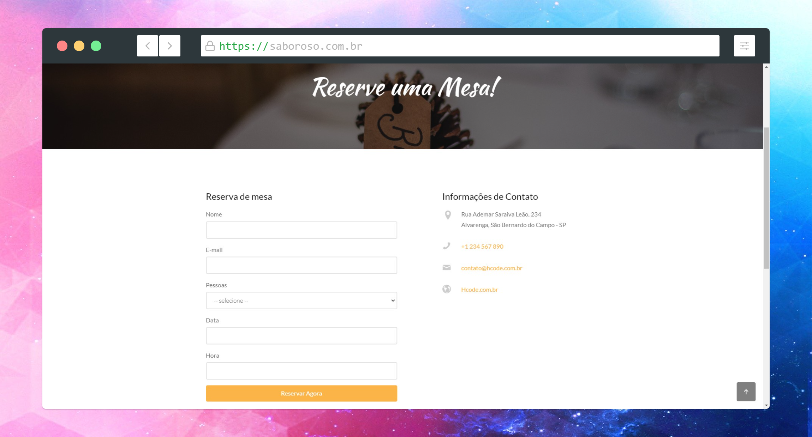
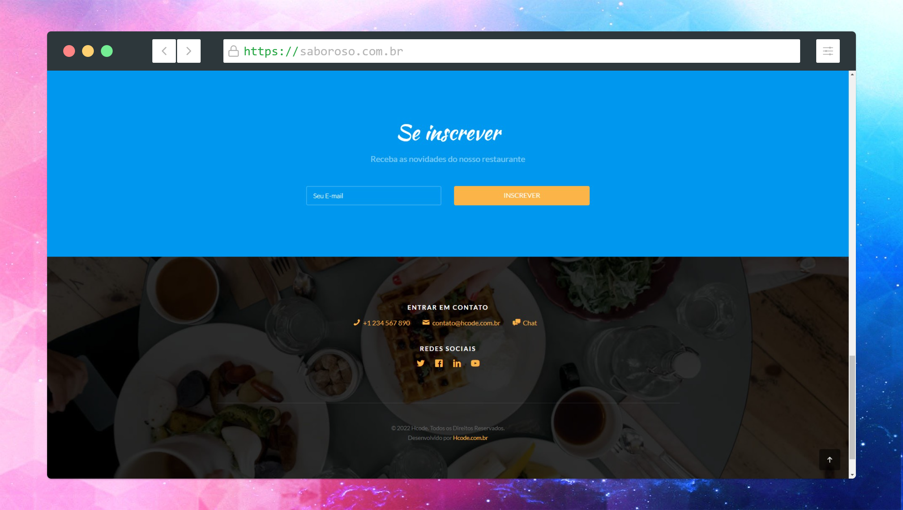
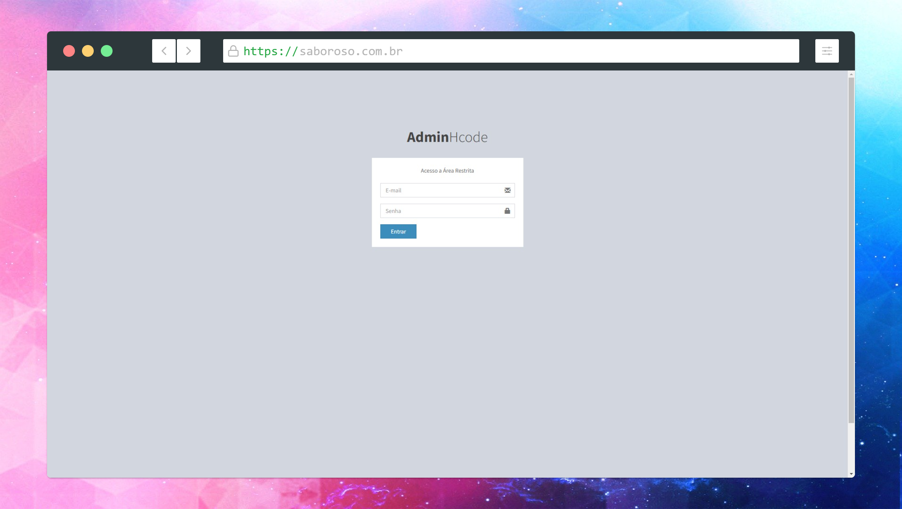
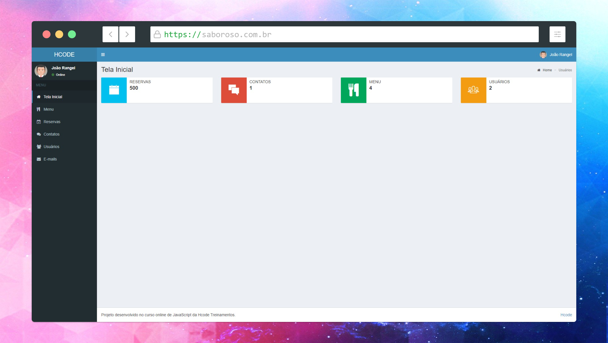
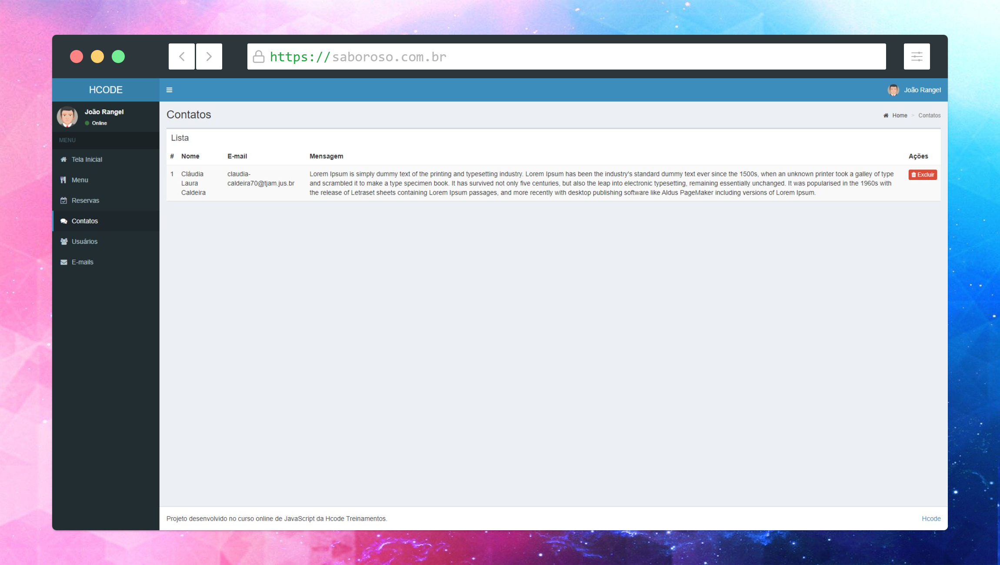
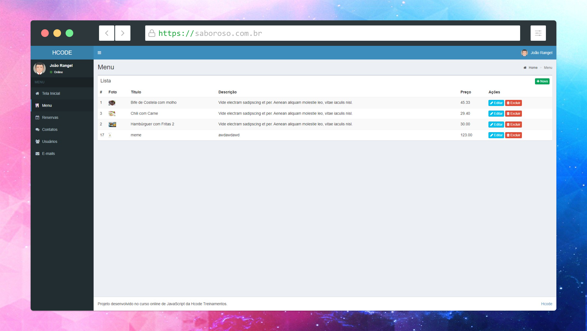
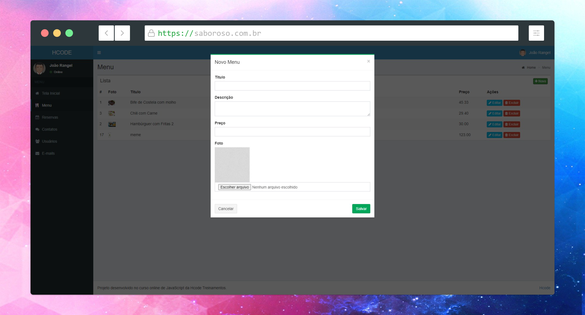
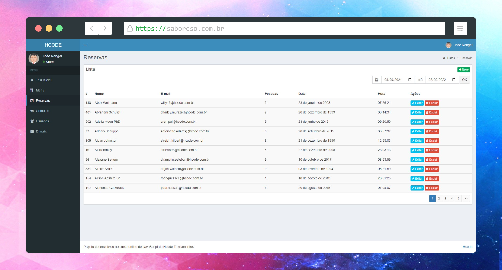
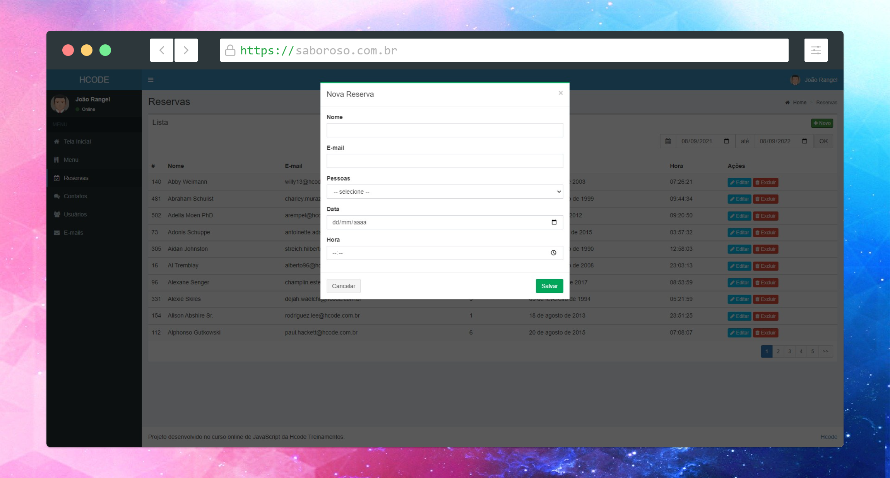
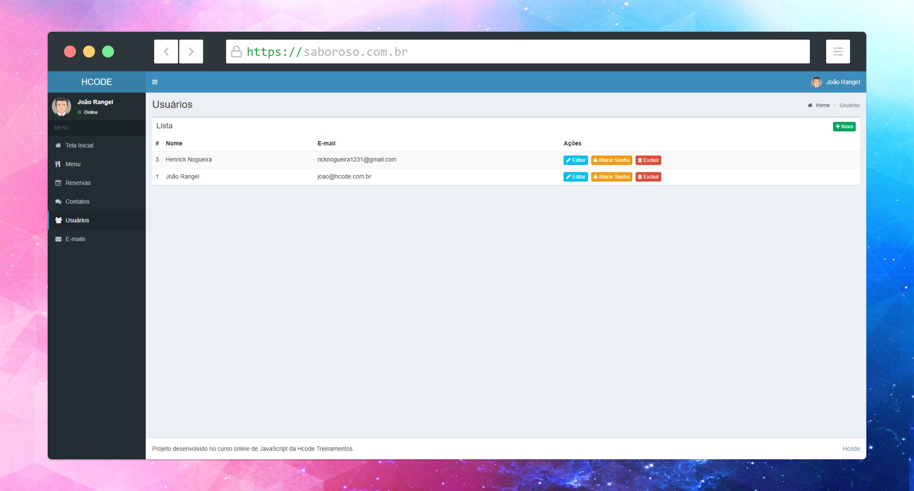

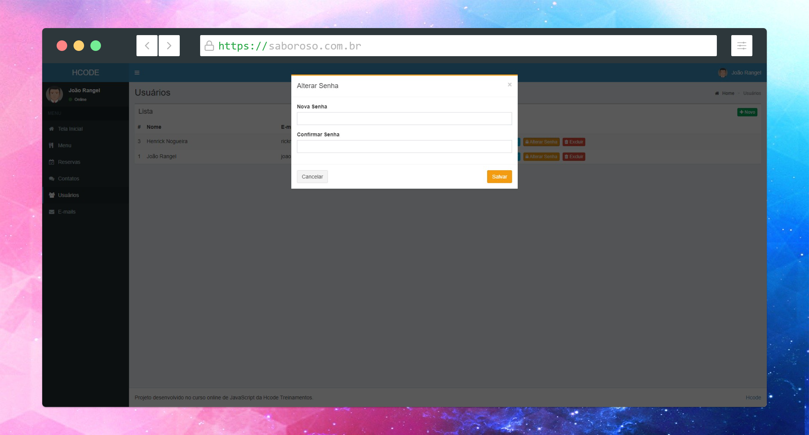

## Project setup
```
npm install
```

### Compiles and hot-reloads for development
```
npm start
```

### Compiles and minifies for production
```
npm run build
```

### Run your tests
```
npm run test
```

### Lints and fixes files
```
npm run lint
```